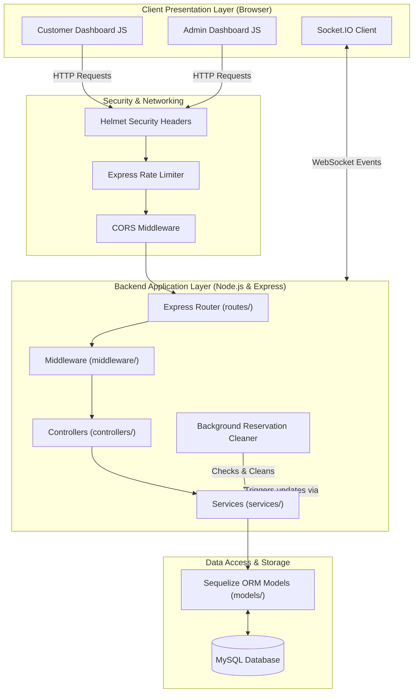
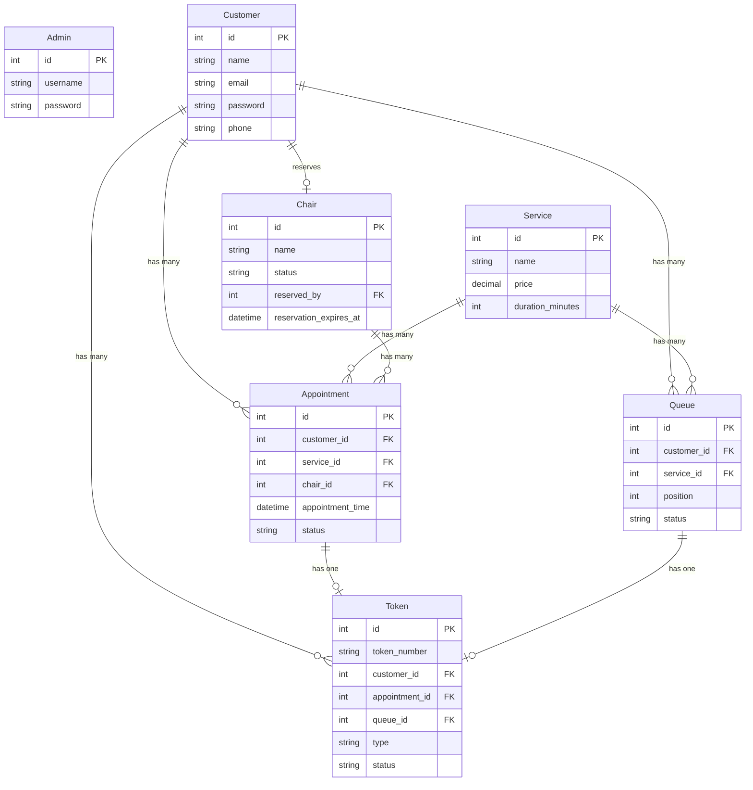
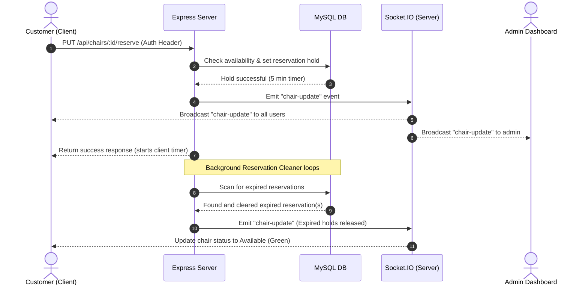

# BarberEase – Project Architecture & Design Documentation

BarberEase is a real-time full-stack web application for barber shops/salons to manage physical chairs, digital booking appointments, and waiting queues. It uses a structured Model-View-Controller (MVC) layered architecture built on Node.js/Express, MySQL (via Sequelize ORM), and Socket.IO for real-time status updates.

---

## 🏛️ High-Level System Architecture

The following diagram illustrates the overall system components, network protocols, and data layers:

---

## 🗃️ Database ER Diagram (Sequelize Models)

The MySQL database schema is mapped using Sequelize ORM. The entities represent customers, admins, physical chairs, salon services, digital appointments, virtual queues, and validation/confirmation tokens.

---

## 🔄 Real-Time Event Flow

BarberEase utilizes Socket.IO to enable real-time synchronization between the database state and client interfaces. For example, when a chair is reserved or updated, all connected clients receive updates immediately.

---

## 📦 File Architecture & Code Structure

The project directory structure is designed to separate concerns cleanly:

### 1. Entry Point
* [server.js](file:///c:/BarberEase/server.js): Initializes the HTTP and Socket.IO servers, configures security middlewares, registers REST routes, and runs the background cleaning loop for chair reservations.

### 2. Configuration & Utilities
* [config/app.js](file:///c:/BarberEase/config/app.js): Loads and structuralizes configuration variables from `.env`.
* [config/database.js](file:///c:/BarberEase/config/database.js): Connects to MySQL database using Sequelize ORM.
* [utils/helpers.js](file:///c:/BarberEase/utils/helpers.js): Helper utilities such as queue token generation and waiting-time calculations.

### 3. Middleware Layer
* [middleware/auth.js](file:///c:/BarberEase/middleware/auth.js): Decodes and validates JWT tokens from incoming request headers, attaching the user payload to `req.user`.
* [middleware/roleGuard.js](file:///c:/BarberEase/middleware/roleGuard.js): Limits access to routes based on user roles (`super_admin`, `admin`, `customer`).
* [middleware/asyncWrapper.js](file:///c:/BarberEase/middleware/asyncWrapper.js): Catches exceptions in async controller routes and forwards them to the error handler.
* [middleware/errorHandler.js](file:///c:/BarberEase/middleware/errorHandler.js): Parses syntax/database errors and outputs consistent JSON error responses.

### 4. Routing Layer
Defines URL paths and hooks them up to validation middlewares and controller handlers:
* [routes/auth.routes.js](file:///c:/BarberEase/routes/auth.routes.js): User & Admin authentication.
* [routes/customer.routes.js](file:///c:/BarberEase/routes/customer.routes.js): Customer management actions.
* [routes/service.routes.js](file:///c:/BarberEase/routes/service.routes.js): Hair salon service configuration.
* [routes/chair.routes.js](file:///c:/BarberEase/routes/chair.routes.js): Chair status monitoring, reserves, and releases.
* [routes/appointment.routes.js](file:///c:/BarberEase/routes/appointment.routes.js): Appointment reservations and seat/complete operations.
* [routes/queue.routes.js](file:///c:/BarberEase/routes/queue.routes.js): Virtual waiting queue check-ins and check-outs.
* [routes/token.routes.js](file:///c:/BarberEase/routes/token.routes.js): Token status verification.
* [routes/report.routes.js](file:///c:/BarberEase/routes/report.routes.js): Metrics and analytics.

### 5. Controller Layer
Coordinates incoming HTTP requests, invokes services, emits Socket.IO updates, and returns JSON payloads:
* [controllers/auth.controller.js](file:///c:/BarberEase/controllers/auth.controller.js)
* [controllers/customer.controller.js](file:///c:/BarberEase/controllers/customer.controller.js)
* [controllers/service.controller.js](file:///c:/BarberEase/controllers/service.controller.js)
* [controllers/chair.controller.js](file:///c:/BarberEase/controllers/chair.controller.js)
* [controllers/appointment.controller.js](file:///c:/BarberEase/controllers/appointment.controller.js)
* [controllers/queue.controller.js](file:///c:/BarberEase/controllers/queue.controller.js)
* [controllers/report.controller.js](file:///c:/BarberEase/controllers/report.controller.js)

### 6. Services (Business Logic) Layer
Encapsulates all database updates, transactional controls, and domain logic rules:
* [services/auth.service.js](file:///c:/BarberEase/services/auth.service.js)
* [services/customer.service.js](file:///c:/BarberEase/services/customer.service.js)
* [services/service.service.js](file:///c:/BarberEase/services/service.service.js)
* [services/chair.service.js](file:///c:/BarberEase/services/chair.service.js)
* [services/appointment.service.js](file:///c:/BarberEase/services/appointment.service.js)
* [services/queue.service.js](file:///c:/BarberEase/services/queue.service.js)
* [services/report.service.js](file:///c:/BarberEase/services/report.service.js)

### 7. Views & Frontend Client
* [views/index.html](file:///c:/BarberEase/views/index.html): Primary landing page view.
* [public/](file:///c:/BarberEase/public): Houses layout stylesheets, assets, and frontend logic scripts utilizing Socket.IO client connections to communicate dynamically with the API server.
